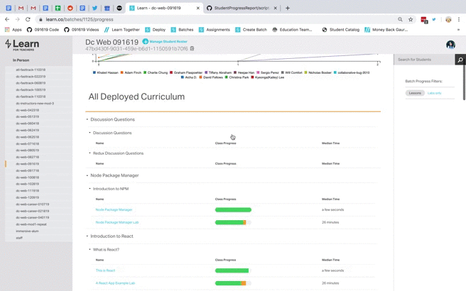

# Flatiron Batch Progress Report Generator

Ever wish you could see which students finished which lessons without having to click on each and every lesson manually? Maybe you want to see how a few particular students are doing in labs, but Learn doesn't provide an intuitive filter for that.

Open up the Chrome Developer Tools in a Learn.co webpage. Copy and paste the source code from script.min.js into the console and replace the batchId and trackId (you can find this information form the Network tab).

You'll see a list of individualized student's lessons progress.
* ✅ The lesson is complete
* 💪 The lesson is in progress
* ❌ The lesson has not been started
